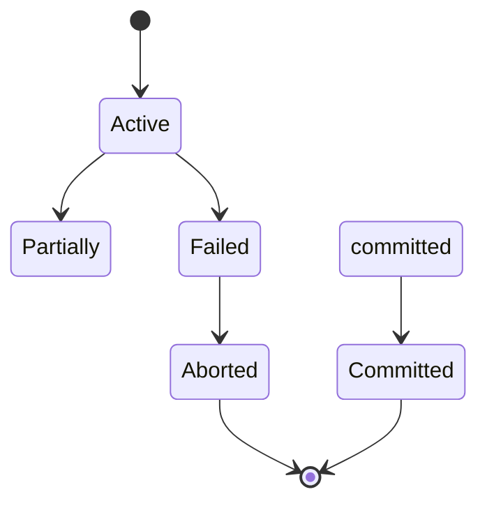

本周阅读**Database-System-Concepts-7th-Edition**:PART SEVEN TRANSACTION MANAGEMENT  
**Chapter 17 Transactions**（p799-p834）,知识点总结如下：  
>日期：6.10

# 事务（Transactions）知识点总结
## 一、事务的基本概念
### （一）定义
事务是程序执行的一个单元，用于访问和可能更新各种数据项。它通常由用高级数据操作语言（典型如 SQL）或编程语言（如 C++、Java，结合 JDBC 或 ODBC 嵌入数据库访问）编写的用户程序发起 ，通过 `begin transaction` 和 `end transaction` 语句（或函数调用）界定范围，包含这两个语句之间执行的所有操作，可表示为：  
事务 = { 操作序列 | `begin transaction` 与 `end transaction` 间的操作 }  

### （二）核心特征
事务需呈现为一个单一、不可分割的单元，要么完整执行，要么完全不执行，即“全有或全无”特性。若执行中因自身故障（如除零错误）、操作系统崩溃、计算机停止运行等失败，已对数据库做的修改必须回滚。  

## 二、事务的 ACID 特性
### （一）原子性（Atomicity）
事务的所有操作要么都在数据库中正确反映，要么都不反映。  
- **实现原理**：数据库系统通过日志（log）跟踪事务写操作涉及数据的旧值，若事务未完成执行，可从日志恢复旧值，仿佛事务从未执行。恢复系统（recovery system）负责保障原子性。  
- **示例**：转账事务 `T_i` 从账户 `A` 转 $50 到账户 `B`，定义为：  
```
T_i: read(A);
     A := A - 50;
     write(A);
     read(B);
     B := B + 50;
     write(B).
```  
若执行 `write(A)` 后、`write(B)` 前失败，未保障原子性会使 `A` 减少但 `B` 未增加，破坏数据一致性。保障原子性则会回滚 `A` 的修改，让事务对数据库无影响。  

### （二）一致性（Consistency）
事务孤立执行（无其他事务并发执行）时，需保持数据库的一致性。以转账为例，要求 `A + B` 的和执行事务前后不变，避免资金凭空创建或销毁。保障一致性是编写事务的应用程序员的责任，可借助完整性约束自动测试辅助。  

### （三）隔离性（Isolation）
多个事务并发执行时，系统需保障对于任意两个事务 `T_i` 和 `T_j`，对 `T_i` 而言，要么 `T_j` 在 `T_i` 开始前已完成，要么 `T_j` 在 `T_i` 完成后才开始。即每个事务察觉不到系统中其他并发执行的事务，避免因操作交叉导致数据不一致。  
- **问题示例**：转账事务执行中，`A` 已扣钱但 `B` 未加钱时，若另一个事务读取 `A` 和 `B` 计算总和，会得到不一致结果，基于此结果更新数据可能使数据库最终不一致。  
- **解决思路**：可串行执行事务（一个接一个执行），但并发执行事务能带来显著性能优势，后续会深入探讨平衡方式。  

### （四）持久性（Durability）
事务成功完成后，其对数据库做的修改需持久化，即便系统后续发生故障。  
- **实现方式**：可通过两种途径保障：  
  1. 事务完成前，将其更新操作写入磁盘。  
  2. 将事务更新操作的相关信息写入磁盘，且这些信息足以在数据库系统故障重启后重建更新。  
数据库的恢复系统同时负责保障原子性和持久性。  

## 三、简单事务模型
### （一）操作定义
为简化研究，聚焦数据在磁盘和主存间的移动，定义两种操作：  
- `read(X)`：将数据库中的数据项 `X` 传输到执行该操作的事务在主存缓冲区中的变量 `X`。  
- `write(X)`：将执行写操作的事务在主存缓冲区中的变量 `X` 的值，传输到数据库中的数据项 `X`。  
实际系统中 `write` 操作不一定立即更新磁盘数据，这里先假设立即更新，后续会深入存储相关问题。  

### （二）应用示例（转账场景）
如前文转账事务 `T_i` 所示，通过 `read` 和 `write` 操作组合，实现从账户 `A` 到账户 `B` 的转账逻辑，可基于此示例验证和理解事务的 ACID 特性。  

## 四、事务的重要性与后续内容
若干数据库操作从用户视角看是单一逻辑单元，这些操作的集合就是事务。数据库系统必须保障事务正确执行（要么全执行，要么全不执行），还要管理事务并发执行，避免引入不一致。本章介绍事务处理基础概念，并发事务处理和故障恢复的细节分别在第 18 章和第 19 章讲解 。  

# 事务处理进阶知识点
## 一、存储结构与事务特性保障
### （一）存储类型分类
为保障事务的原子性和持久性，需先了解数据库数据项的存储访问方式，存储介质按速度、容量、抗故障能力分为以下类型：  
1. **易失性存储（Volatile storage）**  
   - 特点：系统崩溃后，存储的信息通常无法保留。访问速度极快，可直接访问任意数据项。  
   - 示例：主存（main memory）、缓存（cache memory）。  
2. **非易失性存储（Non - volatile storage）**  
   - 特点：系统崩溃后，信息可留存。包含辅助存储（如磁盘、闪存，用于在线存储 ）和三级存储（如光学介质、磁带，用于归档存储 ）。虽速度慢于易失性存储，但仍可能因故障丢失信息。  
   - 示例：磁盘（magnetic disk）、闪存（flash storage）、光学介质（optical media）、磁带（magnetic tapes）。  
3. **稳定存储（Stable storage）**  
   - 理论上：信息永不丢失（极端情况如黑洞摧毁地球除外，实际无法完全实现“永不”，但可通过技术近似 ）。  
   - 实现方式：通过在多个具有独立故障模式的非易失性存储介质（通常是磁盘）中复制信息，且更新时需谨慎处理，避免更新过程中故障导致信息丢失。19.2.1 节会讨论其实现细节。  

### （二）存储类型与事务 ACID 的关联
- **持久性（Durability）**：事务要具备持久性，其修改需写入稳定存储。  
- **原子性（Atomicity）**：事务要具备原子性，日志（log）记录需在磁盘数据库做任何修改前写入稳定存储。系统保障原子性和持久性的程度，取决于稳定存储实现的稳定性。对高价值数据和重要事务，可能需多份副本，更接近理想的稳定存储概念。  

## 二、事务的原子性与持久性（17.4）
### （一）事务状态
事务执行中会经历不同状态，需明确“成功完成”的定义，事务状态包括：  
1. **Active（活跃）**：初始状态，事务执行期间处于此状态。  
2. **Partially committed（部分提交）**：执行完最后一条语句后进入此状态。此时事务虽完成执行，但因输出可能暂存主存，硬件故障仍可能导致无法成功完成，需进一步处理。  
3. **Failed（失败）**：系统判定事务无法继续正常执行（如硬件、逻辑错误）时进入此状态，需回滚（roll back）。  
4. **Aborted（中止）**：事务回滚后，数据库恢复到事务开始前状态，进入此状态。  
5. **Committed（提交）**：事务成功完成后进入此状态，其对数据库的修改需持久化，即便系统后续故障。  

状态转移关系可参考图 17.1（事务状态图）：  


### （二）事务中止与回滚
- **Aborted 事务**：执行失败的事务（aborted transaction）需撤销对数据库的影响，通过回滚实现。恢复模式（recovery scheme）负责管理事务回滚，通常借助日志（log）。事务对数据库的修改先记录日志，包含事务标识、数据项标识、数据项旧值和新值。记录日志后才修改数据库，这样故障时可利用日志撤销修改，保障原子性；也可在故障时重做修改，保障持久性。日志恢复细节见第 19 章。  
- **Committed 事务**：成功完成执行的事务（committed transaction）会将数据库转换为新的一致状态，且该状态需在系统故障后仍留存。提交后的事务无法通过中止撤销影响，需执行补偿事务（compensating transaction），但创建补偿事务并非总能实现，此责任由用户承担，数据库系统不处理。  

### （三）事务失败后的处理
事务进入 failed 状态后回滚至 aborted 状态，此时系统有两种选择：  
1. **Restart（重启）**：仅当事务因硬件或软件错误（非事务内部逻辑导致）中止时，可重启事务，重启后的事务视为新事务。  
2. **Kill（终止）**：因事务内部逻辑错误（需重写应用程序修正 ）、输入错误或数据库中未找到所需数据等情况，可终止事务。  

### （四）可观察的外部写操作（Observable external writes）
处理如写用户屏幕、发邮件等外部写操作时需谨慎，一旦执行无法撤销（可能已被数据库系统外看到 ）。多数系统仅在事务进入 committed 状态后才允许此类操作，实现方式可为：数据库系统将外部写关联值暂存数据库特殊关系中，事务提交后再执行实际写操作。若系统在事务提交后、外部写完成前故障，重启时数据库系统会利用非易失性存储中的数据完成外部写。  

复杂场景示例：  
- ATM  dispensing cash（自动柜员机吐钞）：系统故障前未吐钞，重启时吐钞无意义（用户可能已离开 ），需执行补偿事务（如将现金存回用户账户 ）。  
-  Web  booking（网页预订）：事务提交后，数据库/应用服务器崩溃或网络连接丢失，导致外部写（告知用户预订成功 ）未执行。应用需设计为用户再次连接时，能知晓事务是否成功。  

对于长时运行事务，若要向用户展示数据，可能需在事务原子性上妥协，因输出可观察数据后，若事务回滚，无法撤销外部影响。  

## 三、事务隔离性（17.5）
### （一）并发执行的问题与隔离性要求
事务处理系统通常允许多个事务并发执行，虽能提升性能，但会引发数据一致性问题（如前面转账示例中，事务执行中间状态被其他事务读取，导致计算结果和后续更新错误 ）。  

事务的隔离性（isolation property）要求：多个事务并发执行的系统状态，需等价于这些事务按某一顺序串行执行的状态。保障隔离性是数据库系统中并发控制子系统（concurrency - control system）的责任，细节见第 18 章。  

### （二）计算领域并发趋势（Note 17.1）
计算领域的发展使并发量增加，数据库系统利用并发提升整体性能，导致并发执行的事务数量增多，主要趋势有：  
1. **硬件发展**：早期计算机单处理器，仅能通过操作系统实现任务/进程共享处理器的“表观并发”；现代计算机多处理器、多核，单个芯片可能含多个核，多个芯片可组成共享内存系统，并行数据库系统还可能包含多个这样的系统（并行数据库架构见第 20 章 ）。  
2. **并行的用途**：多处理器和多核提供的并行性用于两方面：一是并行执行单个长查询的不同部分，加速查询；二是允许多个查询（常为小查询 ）并发执行，支持大量并发用户。第 21 - 23 章会介绍构建并行数据库系统的算法。  

# 事务调度与可串行化知识点总结

## 一、事务定义与示例
### （一）事务操作定义
假设有两个事务 `T₁` 和 `T₂`，涉及账户 `A` 和 `B` 的操作：  
- **事务 `T₁`**：从账户 `A` 转 $50 到账户 `B`，定义为：  
```
T₁: read(A);
     A := A - 50;
     write(A);
     read(B);
     B := B + 50;
     write(B).
```  
- **事务 `T₂`**：将账户 `A` 余额的 10% 转到账户 `B`，定义为：  
```
T₂: read(A);
     temp := A * 0.1;
     A := A - temp;
     write(A);
     read(B);
     B := B + temp;
     write(B).
```  
>日期：6.12  
## 二、事务调度（Schedules）
### （一）串行调度（Serial Schedules）
串行调度指多个事务按顺序依次执行，一个事务全部完成后，另一个才开始。  
- **示例 1（`T₁` 先于 `T₂` 执行）**：调度序列如图 17.2 所示，执行步骤按时间顺序从上到下，`T₁` 指令在左列，`T₂` 指令在右列。初始 `A = $1000`，`B = $2000`，执行后 `A = $855`，`B = $2145`，`A + B` 总和保持不变（`3000`）。  
- **示例 2（`T₂` 先于 `T₁` 执行）**：调度序列如图 17.3 所示，执行后 `A = $850`，`B = $2150`，`A + B` 总和同样保持 `3000`。  

对于 `n` 个事务，串行调度的数量为 `n!`（`n` 的阶乘 ），即不同的事务执行顺序组合数。  

### （二）并发调度（Concurrent Schedules）
数据库系统允许多个事务并发执行时，调度不再是串行的。操作系统会在事务间进行上下文切换，CPU 时间在事务间共享，指令可能交叉执行。  
- **等价并发调度**：部分并发调度效果与串行调度等价。例如图 17.4 中的调度，执行后状态与 `T₁` 先、`T₂` 后串行执行的状态一致，`A + B` 总和仍保持不变。  
- **不一致并发调度**：并非所有并发调度都能保证数据一致。如图 17.5 中的调度，执行后 `A = $950`，`B = $2100`，`A + B = 3050`，与初始总和 `3000` 不一致，导致数据库处于不一致状态。  


## 三、可串行化（Serializability）
### （一）定义与作用
数据库系统需保障并发执行事务后，数据库仍处于一致状态。可串行化调度指并发调度的效果等价于某一种串行调度的效果，这样的调度能保障隔离性，维持数据库一致性。  

### （二）判断难度与简化模型
因事务是程序，难精确判定其操作及交互，故简化模型：仅考虑 `read` 和 `write` 操作。假设事务在 `read(Q)` 和 `write(Q)` 指令间，可对数据项 `Q` 在本地缓冲区的副本执行任意操作，模型中事务的关键操作就是 `read` 和 `write`。  


## 四、并发执行的动机
虽并发执行事务需额外管理工作，但有以下优势，故数据库系统允许并发：  
1. **提升吞吐量和资源利用率**：事务包含 I/O 和 CPU 操作，CPU 和磁盘可并行工作。利用 CPU 和 I/O 系统的并行性，可同时运行多个事务。比如一个事务在磁盘执行读写时，另一个事务可在 CPU 运行，第三个事务可在另一磁盘执行读写，提升单位时间内执行的事务数量（吞吐量 ），同时提高处理器和磁盘利用率（减少空闲时间 ）。  
2. **减少等待时间**：系统中事务有长有短，串行执行时短事务可能需等待长事务完成，导致不可预测延迟。若事务操作数据库不同部分，并发执行可共享 CPU 周期和磁盘访问，减少事务运行的不可预测延迟，降低平均响应时间（事务提交后到完成的平均时间 ）。  


## 五、并发控制的职责与机制
数据库系统需通过**并发控制机制（concurrency-control schemes）**管理并发事务交互，防止破坏数据库一致性，具体内容在第 18 章深入探讨，本章聚焦正确并发执行的概念。  

# 冲突可串行化（Conflict Serializability）知识点总结

## 一、冲突操作与冲突等价
### （一）冲突操作定义
对于调度 `S` 中来自不同事务 `T_i` 和 `T_j`（`i ≠ j`）的连续指令 `I` 和 `J`，若满足以下条件，则称 `I` 和 `J` **冲突（conflict）**：  
- 操作同一数据项 `Q`；  
- 至少有一个操作是写操作（`write`）。  

### （二）冲突等价（Conflict Equivalence）
若调度 `S` 可通过交换一系列**非冲突指令**转换为调度 `S'`，则称 `S` 和 `S'` 是**冲突等价**的。非冲突指令指：  
- 操作不同数据项的指令；  
- 均为读操作（`read`）的指令（对同一数据项，读操作顺序不影响结果 ）。  


## 二、冲突可串行化判定
### （一）冲突可串行化定义
若调度 `S` 与某一**串行调度**冲突等价，则称 `S` 是**冲突可串行化（conflict serializable）** 的。  

### （二）前驱图（Precedence Graph）方法
判定冲突可串行化的关键是构建**前驱图**，步骤如下：  
1. **顶点（Vertices）**：图中顶点为参与调度的所有事务（如 `T₁, T₂, ..., Tₙ` ）。  
2. **边（Edges）**：若满足以下任一条件，添加有向边 `T_i → T_j`：  
   - `T_i` 的 `write(Q)` 操作在 `T_j` 的 `read(Q)` 操作之前执行；  
   - `T_i` 的 `read(Q)` 操作在 `T_j` 的 `write(Q)` 操作之前执行；  
   - `T_i` 的 `write(Q)` 操作在 `T_j` 的 `write(Q)` 操作之前执行。  

3. **环检测（Cycle Detection）**：若前驱图中**无环**，则调度是冲突可串行化的；若有环，则不是。  


## 三、示例与推导
### （一）冲突操作分析（以 `read` 和 `write` 为例）
对于两个事务 `T_i` 和 `T_j` 的连续指令 `I` 和 `J`（操作同一数据项 `Q` ），需考虑以下 4 种情况（仅读操作不冲突，其他可能冲突 ）：  
1. `I = read(Q), J = read(Q)`：不冲突，顺序不影响结果。  
2. `I = read(Q), J = write(Q)`：冲突，顺序影响 `T_i` 是否读取 `T_j` 写入的值。  
3. `I = write(Q), J = read(Q)`：冲突，顺序影响 `T_j` 读取的值（`T_i` 写入前/后的值 ）。  
4. `I = write(Q), J = write(Q)`：冲突，顺序影响后续 `read(Q)` 操作读取的值及最终数据库中 `Q` 的值。  


### （二）调度转换与冲突等价示例
以调度 3（仅含 `read` 和 `write` 操作）为例：  
- `T₁` 的 `write(A)` 与 `T₂` 的 `read(A)` 冲突，但 `T₂` 的 `write(A)` 与 `T₁` 的 `read(B)` 不冲突（操作不同数据项 ）。  
- 交换不冲突的指令，可将调度 3 转换为调度 5（仍冲突等价 ），继续交换非冲突指令最终可得到串行调度（如调度 6 ），证明调度 3 是冲突可串行化的。  


### （三）前驱图构建与环检测示例
- **串行调度 1**：`T₁` 全执行完后 `T₂` 执行，前驱图只有边 `T₁ → T₂`，无环，是冲突可串行化。  
- **调度 4**：`T₁` 和 `T₂` 操作交叉，前驱图中存在 `T₁ → T₂` 和 `T₂ → T₁` 的环，不是冲突可串行化。  


## 四、关键结论
- 冲突可串行化调度能保障数据库并发执行的一致性，等价于某串行调度的效果。  
- 判定冲突可串行化的核心是构建前驱图并检测环，无环则满足，有环则不满足。  
- 存在结果相同但非冲突等价的调度（如 `T₁` 和 `T₅` 的特殊场景 ），但冲突可串行化是常用且有效的判定方式。  


```mermaid
graph TD
    A[T1] --> B[T2]  // 示例：串行调度前驱图
    C[T1] --> D[T2]
    D --> C          // 示例：含环前驱图（非冲突可串行化）
```

# 事务隔离与调度恢复相关知识点总结

## 一、可恢复调度（Recoverable Schedules）
### （一）定义
若调度中，对于每对事务 `T_i` 和 `T_j`，当 `T_j` 读取了 `T_i` 之前写入的数据项时，`T_i` 的提交操作（`commit`）需出现在 `T_j` 的提交操作之前，则该调度是**可恢复调度**。  

### （二）示例与反例
- **非可恢复调度示例**：图 17.14 中，`T₇` 读取 `T₆` 写入的 `A` 后立即提交，若 `T₆` 后续失败，`T₇` 已提交无法回滚，破坏原子性，属于非可恢复调度。  
- **可恢复调度要求**：要让该调度可恢复，`T₇` 需延迟提交，直到 `T₆` 提交后再执行 `commit`。  


## 二、无级联回滚调度（Cascadeless Schedules）
### （一）级联回滚问题
若事务 `T_i` 失败，可能导致一系列依赖它的事务（读取过 `T_i` 写入数据的事务）回滚，这种现象称为**级联回滚（cascading rollback）**。例如图 17.15 中，`T₈` 失败，`T₉`（依赖 `T₈` 写入的 `A` ）、`T₁₀`（依赖 `T₉` 写入的 `A` ）需依次回滚，会撤销大量工作。  

### （二）无级联回滚调度定义
若调度中，对于每对事务 `T_i` 和 `T_j`，当 `T_j` 读取 `T_i` 之前写入的数据项时，`T_i` 的提交操作出现在 `T_j` 的读取操作之前，则该调度是**无级联回滚调度**。此类调度可避免级联回滚，且一定是可恢复调度。  


## 三、事务隔离级别（Transaction Isolation Levels）
为平衡并发性能与数据一致性，SQL 标准定义了不同隔离级别，从高到低约束逐渐宽松：  

### （一）各隔离级别说明
1. **可串行化（Serializable）**：  
   理论上保证调度可串行化，但部分数据库实现可能存在特殊场景不严格满足。要求事务执行等效于串行执行，避免并发冲突。  
   ```sql
   -- SQL 设置可串行化隔离级别的语句（不同数据库语法有差异，以通用示例）
   SET TRANSACTION ISOLATION LEVEL SERIALIZABLE;
   ```  

2. **可重复读（Repeatable Read）**：  
   仅允许读取已提交数据，且同一事务内多次读取同一数据项时，其他事务不能更新该数据项。但可能因新插入数据导致幻读，不保证完全可串行化。  

3. **读已提交（Read Committed）**：  
   仅允许读取已提交数据，但不要求可重复读。同一事务内多次读取同一数据项时，其他事务提交的更新可能被读到。多数数据库默认采用此级别。  

4. **读未提交（Read Uncommitted）**：  
   允许读取未提交数据（脏读），是最低隔离级别，可能导致数据不一致，但并发性能最高。  


### （二）隔离级别设置与影响
- **设置方式**：不同数据库设置语法有差异，如：  
  - MySQL/Oracle/PostgreSQL：`SET TRANSACTION ISOLATION LEVEL [级别]`；  
  - JDBC 中可通过 `Connection` 接口设置：  
    ```java
    // JDBC 设置可串行化隔离级别示例
    connection.setTransactionIsolation(Connection.TRANSACTION_SERIALIZABLE);
    ```  
- **权衡选择**：弱隔离级别（如读未提交、读已提交 ）可提升并发性能，但需开发者更关注数据一致性；强隔离级别（可串行化 ）保障一致性，但可能因锁机制降低并发效率。  


## 四、视图可串行化（View Serializability，补充概念）
### （一）定义与特点
基于读写操作定义的另一种调度等价性，要求调度满足：  
1. 初始读一致（事务读取初始数据的方式与串行调度一致 ）；  
2. 写传播一致（事务写入数据的影响与串行调度一致 ）；  
3. 最终写一致（最终数据的写入者与串行调度一致 ）。  

因计算复杂度高（需分析事务具体操作逻辑，而非仅冲突操作 ），实际中较少使用，常作为理论补充。  

### （二）示例
调度 8（`T₁` 和 `T₅` 交叉操作 ）虽结果与串行调度 `<T₁, T₅>` 一致，但因操作依赖复杂（如 `T₁` 与 `T₅` 对 `A`、`B` 的读写交叉 ），不满足视图可串行化。  


## 五、关键结论
- 可恢复调度和无级联回滚调度用于保障事务失败时的原子性，避免级联回滚带来的性能损耗。  
- 事务隔离级别通过不同约束平衡并发与一致性，开发者需根据业务场景选择（如分析类任务可降低隔离级别提升性能，金融类任务需高隔离保障准确 ）。  
- 视图可串行化是理论概念，因实现复杂实际中多依赖冲突可串行化或隔离级别机制。  

# 事务并发控制与隔离级别实现知识点总结  

## 一、并发控制策略（Concurrency-Control Policies）  
### （一）核心目标  
在保证事务调度满足 **可串行化（冲突/视图可串行化）、可恢复、无级联回滚** 的前提下，最大化并发度，平衡性能与数据一致性。  


### （二）锁机制基础（Locking）  
1. **全库锁（Trivial Locking）**  
   - 策略：事务开始前加全库锁，提交/回滚后释放。  
   - 效果：仅允许串行调度，保障可串行化，但并发度极低（无实际并发）。  
   - 示例（伪代码逻辑）：  
     ```python
     def transaction():
         lock(database)  # 加全库锁
         try:
             # 事务操作（读写）
             commit()
         except:
             rollback()
         finally:
             unlock(database)  # 释放锁
     ```  

2. **细粒度锁（Fine-Grained Locking）**  
   - 策略：仅锁定事务访问的数据项（而非全库），需平衡锁持有时间：  
     - 持有足够久 → 保障可串行化；  
     - 释放足够快 → 减少性能损耗。  


## 二、快照隔离（Snapshot Isolation）  
### （一）核心特性  
- 读操作无需等待锁（读自己的数据库快照/版本 ），提升读性能。  
- 只读事务不会回滚，修改型事务可能因并发冲突回滚（如提交时检测到其他事务修改了自己依赖的数据 ）。  


### （二）问题与优化  
- **问题**：可能出现“双盲更新”（两个事务互相修改对方依赖的数据，且均未感知对方更新 ），导致非可串行化调度，破坏数据一致性。  
- **优化方案**：  
  - 部分数据库（如 PostgreSQL 9.1+ ）实现 **可串行化快照隔离（Serializable Snapshot Isolation）**，在保留快照隔离性能优势的同时，保障可串行化。  


## 三、SQL 事务的复杂性（Transactions as SQL Statements）  
### （一）幻读问题（Phantom Phenomenon）  
- **定义**：因 `INSERT`/`DELETE` 操作，导致同一事务中重复查询结果集变化（“ phantom 数据”引发的冲突 ）。  
- **示例**：  
  ```sql
  -- 事务 T：查询工资 > 90000 的教师
  SELECT ID, name FROM instructor WHERE salary > 90000;

  -- 并发事务 T'：插入新教师（工资 100000 ）
  INSERT INTO instructor VALUES ('11111', 'James', 'Marketing', 100000);
  ```  
  - 现象：T 首次查询无 James，T' 插入后 T 再次查询出现 James，引发幻读。  
  - 本质：简单冲突检测模型（仅跟踪具体数据项）无法识别“查询条件依赖的元数据/数据集范围”变化。  


### （二）应对方案  
需扩展并发控制逻辑，不仅锁定**访问的数据项**，还要锁定**用于定位数据项的条件/索引**（如 `WHERE` 子句依赖的索引、表结构元数据 ），具体实现（如索引锁、 predicate 锁 ）在 Chapter 18 深入讨论。  


## 四、隔离级别实现权衡  
### （一）实践场景矛盾  
严格可串行化（如 `SERIALIZABLE` 级别 ）保障一致性，但可能因锁竞争降低并发；弱隔离级别（如 `READ UNCOMMITTED` ）提升性能，但需开发者手动处理数据不一致风险。  


### （二）典型业务折中  
- **电商库存扣减**：允许“读未提交”降低锁竞争，通过最终对账/补偿机制修复少量不一致。  
- **航空座位预订**：核心提交阶段（确认选座）需强一致性，选座浏览阶段用快照隔离提升体验，最终提交时校验座位状态。  


## 五、关键结论  
1. 并发控制策略需在 **一致性（可串行化、可恢复）** 和 **性能（并发度、响应时间）** 间权衡。  
2. 锁机制是基础，但细粒度锁、快照隔离等优化方案需结合业务场景选择。  
3. SQL 事务的复杂性（幻读、动态查询条件 ）要求并发控制覆盖“数据项访问”+“数据定位逻辑”，实现更复杂。  

# summary  

## 一、事务基础（Transaction Fundamentals）  
### （一）事务定义与 ACID 特性  
- **定义**：访问并可能更新数据库中多个数据项的程序执行单元，需保证并发执行和故障场景下的数据库一致性。  
- **ACID 特性**：  
  - **原子性（Atomicity）**：事务操作“全提交”或“全回滚”，无部分执行状态。  
  - **一致性（Consistency）**：事务执行前后，数据库从一个一致状态转移到另一个一致状态（依赖应用逻辑保障 ）。  
  - **隔离性（Isolation）**：并发事务相互隔离，每个事务感知不到其他事务的并发执行。  
  - **持久性（Durability）**：事务提交后，更新持久化存储，不受系统故障影响。  


### （二）存储类型与数据持久化  
- **存储分类**：  
  - 易失性存储（如 RAM ）：系统崩溃后数据丢失。  
  - 非易失性存储（如磁盘 ）：系统崩溃后数据保留，但可能因磁盘故障丢失。  
  - 稳定存储（如镜像磁盘、RAID ）：通过冗余实现数据永不丢失（理论上 ）。  


## 二、并发事务调度（Concurrent Transaction Scheduling）  
### （一）调度与可串行化（Serializability）  
- **调度（Schedule）**：抽象事务关键操作（读、写 ）的执行顺序，忽略事务内部细节。  
- **可串行化目标**：并发调度的效果需等价于**某串行调度**（事务依次执行的调度 ），保障数据一致性。  


### （二）冲突可串行化与视图可串行化  
- **冲突可串行化（Conflict Serializability）**：通过交换**非冲突操作**（操作不同数据项或均为读操作 ），调度可转换为串行调度。可通过**前驱图（Precedence Graph）** 检测（无环则满足 ）。  
- **视图可串行化（View Serializability）**：更严格的等价性，要求初始读、写传播、最终写一致。因计算复杂，实际中较少直接使用。  


## 三、并发控制策略（Concurrency-Control Policies）  
### （一）锁机制（Locking）  
- **共享锁（Shared Lock, S-Lock）** 与 **排他锁（Exclusive Lock, X-Lock）**：  
  - 共享锁：允许多个事务并发读，`S-Lock` 间不冲突。  
  - 排他锁：仅允许一个事务写，与任何锁（S/X ）冲突。  
  - 规则：事务写数据项时需加 X-Lock，读时可加 S-Lock；加 X-Lock 前需确保无其他锁，加 S-Lock 前需确保无 X-Lock。  
- **两阶段锁协议（Two-Phase Locking, 2PL）**：  
  - 事务分两个阶段：  
    1. **增长阶段**：仅加锁，不释放锁。  
    2. **缩减阶段**：仅释放锁，不加锁。  
  - 作用：保障调度冲突可串行化（但可能产生死锁 ）。  


### （二）时间戳排序（Timestamps Ordering）  
- **时间戳分配**：事务开始时分配唯一时间戳（如系统时钟、逻辑计数器 ）。  
- **数据项时间戳**：维护 `read_ts(Q)`（最大读事务时间戳 ）和 `write_ts(Q)`（最大写事务时间戳 ）。  
- **冲突处理**：若事务访问数据项的时间戳与 `read_ts`/`write_ts` 冲突，回滚事务并重新分配时间戳执行。  


### （三）多版本与快照隔离（Multiple Versions & Snapshot Isolation）  
- **多版本控制**：维护数据项的多个版本，读操作可访问旧版本，避免锁竞争。  
- **快照隔离**：事务开始时获取数据库快照（数据版本 ），读操作访问快照，写操作仅修改私有版本（提交时合并到主库 ）。  
- **问题**：可能因“双盲更新”导致非可串行化，需结合可串行化快照隔离（如 PostgreSQL 实现 ）优化。  


## 四、调度的恢复性（Recoverable Schedules）  
### （一）可恢复调度与无级联回滚  
- **可恢复调度**：若事务 `T_j` 读取 `T_i` 写入的数据，则 `T_i` 提交需在 `T_j` 提交前。避免 `T_i` 回滚后 `T_j` 已提交无法回滚的问题。  
- **无级联回滚调度**：事务仅读取已提交数据，避免级联回滚（一个事务回滚导致多个依赖事务回滚 ）。  


### （二）幻读与谓词锁（Phantom Phenomenon & Predicate Locking）  
- **幻读问题**：因 `INSERT`/`DELETE` 操作，同一事务重复查询结果集变化（如查询工资 > 90000 的教师，并发插入新教师导致结果变化 ）。  
- **谓词锁**：锁定“查询条件（谓词）”影响的数据集，而非具体数据项。例如，对 `salary > 90000` 的谓词加锁，阻止并发更新/插入影响该结果集的操作。  


## 五、隔离级别与实践权衡  
### （一）SQL 隔离级别  
数据库提供弱于可串行化的隔离级别（如读未提交、读已提交 ），以牺牲部分一致性为代价提升并发性能。需根据业务场景选择（如分析场景用弱隔离，金融场景用强隔离 ）。  


### （二）实现挑战与折中  
- 严格可串行化（如 `SERIALIZABLE` ）保障一致性，但锁竞争可能降低性能。  
- 弱隔离级别需开发者手动处理数据不一致（如脏读、幻读 ），但适合高并发、对一致性要求稍低的场景。  


## 关键公式与模型  
1. **前驱图环检测**：若调度的前驱图无环，则为冲突可串行化。  
2. **两阶段锁协议**：  
   ```plaintext
   增长阶段（加锁） → 缩减阶段（释放锁）
   ```  
3. **时间戳冲突规则**：  
   - 读操作：事务时间戳 `ts` ≤ `write_ts(Q)` → 回滚；否则更新 `read_ts(Q)`。  
   - 写操作：事务时间戳 `ts` ≤ `read_ts(Q)` 或 `ts` ≤ `write_ts(Q)` → 回滚；否则更新 `write_ts(Q)`。

>日期：6.13  
课后习题选做


## 17.12 List the ACID properties. Explain the usefulness of each.  
### 解析与答案  
ACID 是事务的四大核心特性，作用如下：  

| 特性          | 定义与作用                                                                 |  
|---------------|--------------------------------------------------------------------------|  
| **原子性（Atomicity）** | 事务操作“全成功提交”或“全回滚撤销”，避免部分执行导致数据不一致。如转账失败时，需回滚扣款与存款操作。 |  
| **一致性（Consistency）** | 事务执行前后数据库从一个合法状态转移到另一个合法状态（依赖业务规则）。如转账需保证总金额不变。       |  
| **隔离性（Isolation）** | 并发事务相互隔离，每个事务感知不到其他事务的并发执行，避免脏读、幻读等问题。                     |  
| **持久性（Durability）** | 事务提交后，更新持久化存储（如磁盘），不受系统崩溃影响，保障数据不丢失。                         |  


## 17.13 Transaction States & Transitions  
### 解析与答案  
事务执行过程的状态及转移如下：  

1. **活动状态（Active）**：事务开始执行，执行读写操作。  
2. **部分提交状态（Partially Committed）**：事务完成最后一条操作，但未正式提交。  
3. **提交状态（Committed）**：事务成功提交，更新持久化（进入此状态后不可回滚）。  
4. **失败状态（Failed）**：执行中检测到错误（如违反约束、系统故障 ），需回滚。  
5. **中止状态（Aborted）**：事务回滚完成，数据库恢复到事务开始前状态。  

**典型转移路径**：  
- 正常执行：`Active → Partially Committed → Committed`  
- 执行失败：`Active → Failed → Aborted`（回滚后可重试：`Aborted → Active` ）  


## 17.14 Serial Schedule vs. Serializable Schedule  
### 解析与答案  
| 概念                  | 定义                                                                 |  
|-----------------------|----------------------------------------------------------------------|  
| **Serial Schedule**   | 事务**完全串行执行**（一个事务结束后，另一个才开始），天然保障一致性。                |  
| **Serializable Schedule** | 并发调度的效果**等价于某串行调度**（通过冲突等价、视图等价等规则判定 ），保障一致性的同时提升并发。 |  

**示例**：  
- 串行调度：`T1` 全执行完 → `T2` 执行。  
- 可串行化调度：`T1` 和 `T2` 交叉执行，但效果与 `T1→T2` 或 `T2→T1` 的串行调度一致。  


## 17.15 Two Transactions: Consistency & Serializability  
### 题目回顾  
事务定义：  
```plaintext
T₁₃: read(A); read(B); if A=0 then B:=B+1; write(B).  
T₁₄: read(B); read(A); if B=0 then A:=A+1; write(A).  
```  
初始状态：`A=0, B=0`，一致性要求：`A=0 ∨ B=0`。  


#### a. Show that every serial execution preserves consistency.  
**解析与答案**：  
串行执行有两种顺序：`T₁₃→T₁₄` 或 `T₁₄→T₁₃`，需验证两种情况均满足 `A=0 ∨ B=0`。  

- **顺序 1：T₁₃ → T₁₄**  
  1. `T₁₃` 执行：  
     - `read(A)=0, read(B)=0` → 因 `A=0`，执行 `B:=0+1=1` → `write(B)`，结果 `A=0, B=1`。  
  2. `T₁₄` 执行：  
     - `read(B)=1, read(A)=0` → `B≠0`，不执行 `A:=A+1` → 结果 `A=0, B=1`。  
  3. 验证一致性：`A=0 ∨ B=0` → `0∨1=1`（满足 ）。  


- **顺序 2：T₁₄ → T₁₃**  
  1. `T₁₄` 执行：  
     - `read(B)=0, read(A)=0` → 因 `B=0`，执行 `A:=0+1=1` → `write(A)`，结果 `A=1, B=0`。  
  2. `T₁₃` 执行：  
     - `read(A)=1, read(B)=0` → `A≠0`，不执行 `B:=B+1` → 结果 `A=1, B=0`。  
  3. 验证一致性：`A=0 ∨ B=0` → `1∨0=1`（满足 ）。  


#### b. Show a concurrent execution producing a nonserializable schedule.  
**解析与答案**：  
构造交叉执行的调度，使其不满足冲突可串行化（前驱图存在环 ）。  

**调度示例**：  
```plaintext
T₁₃: read(A)  → 读 A=0  
T₁₄: read(B)  → 读 B=0  
T₁₃: read(B)  → 读 B=0 → 因 A=0，执行 B:=1（暂存，未写）  
T₁₄: read(A)  → 读 A=0 → 因 B=0，执行 A:=1（暂存，未写）  
T₁₃: write(B) → B=1  
T₁₄: write(A) → A=1  
```  

**结果**：`A=1, B=1`，不满足 `A=0 ∨ B=0`（一致性破坏 ）。  
**前驱图分析**：  
- `T₁₃` 的 `write(B)` 与 `T₁₄` 的 `read(B)` 冲突 → 边 `T₁₃→T₁₄`。  
- `T₁₄` 的 `write(A)` 与 `T₁₃` 的 `read(A)` 冲突 → 边 `T₁₄→T₁₃`。  
- 前驱图存在环（`T₁₃↔T₁₄` ），故为**非可串行化调度**。  


#### c. Is there a concurrent execution producing a serializable schedule?  
**解析与答案**：  
是的。构造冲突等价于串行调度的并发执行（前驱图无环 ）。  

**调度示例（等价于 T₁₃→T₁₄ ）**：  
```plaintext
T₁₃: read(A) → A=0  
T₁₃: read(B) → B=0  
T₁₃: write(B) → B=1  
T₁₄: read(B) → B=1  
T₁₄: read(A) → A=0  
T₁₄: write(A) → 无操作（因 B≠0 ）  
```  

**结果**：`A=0, B=1`，满足一致性。  
**前驱图分析**：  
- 仅存在 `T₁₃→T₁₄` 的边（因 `T₁₃` 的写操作先于 `T₁₄` 的读操作 ），无环 → **可串行化调度**。  


## 17.16 Serializable Schedule with Different Commit Order  
### 解析与答案  
**需求**：构造两个事务的可串行化调度，且**提交顺序与串行化顺序不同**。  

**示例**：  
设事务 `T₁`（写 `X` ）、`T₂`（读 `X` ），串行化顺序为 `T₁→T₂`，但提交顺序 `T₂→T₁`。  

调度步骤：  
```plaintext
T₁: write(X)   → 写操作（未提交）  
T₂: read(X)    → 读 T₁ 写入的 X（依赖 T₁ ）  
T₂: commit     → T₂ 提交（先于 T₁ ）  
T₁: commit     → T₁ 提交  
```  

**说明**：  
- 串行化顺序由读写依赖决定（`T₁→T₂` ，因 `T₂` 读 `T₁` 写的 `X` ）。  
- 提交顺序为 `T₂→T₁`，但调度仍可串行化（效果等价于 `T₁→T₂` ）。  


## 17.17 Recoverable Schedules  
### 解析与答案  
#### Q1: What is a recoverable schedule?  
**定义**：若事务 `T_j` 读取了 `T_i` 写入的数据，则 `T_i` 的提交操作必须在 `T_j` 的提交操作**之前**。避免 `T_i` 回滚后，`T_j` 已提交无法回滚的问题。  


#### Q2: Why is recoverability desirable?  
**必要性**：保障故障恢复时的原子性。若 `T_i` 回滚（如失败 ），所有依赖 `T_i` 数据的 `T_j` 需回滚，否则会导致脏数据持久化。  


#### Q3: Allow non-recoverable schedules?  
**特殊场景**：某些短期事务/只读事务，或通过额外日志/补偿机制保证最终一致性时，可放宽 recoverable 要求以提升并发。但需严格评估数据一致性风险。  


## 17.18 Why Support Concurrent Execution?  
### 解析与答案  
数据库支持事务并发执行的核心原因：  

1. **提升吞吐量**：多个事务同时执行，充分利用 CPU、磁盘等资源，减少整体执行时间。  
2. **降低等待时间**：避免长事务独占资源，短事务无需长时间等待。  
3. **优化资源利用**：并发执行可平衡 CPU 计算与磁盘 I/O，最大化系统利用率。  

尽管需额外实现并发控制（如锁、时间戳 ）保障一致性，但性能收益远大于实现成本。  


## 17.19 Read-Committed Isolation & Cascadeless  
### 解析与答案  
**读已提交（Read-Committed）隔离级别**：事务仅能读取已提交的数据。  

**为何无级联回滚（Cascadeless）**：  
- 因事务只能读取已提交数据，若 `T_j` 依赖 `T_i` 的数据，则 `T_i` 必须已提交（否则 `T_j` 读不到 ）。  
- 若 `T_i` 后续回滚，`T_j` 未读取到 `T_i` 的未提交数据，无需级联回滚 → 保障调度是 cascadeless。  


## 17.20 Nonserializable Schedules per Isolation Level  
### 解析与答案  
需为每个隔离级别构造**满足隔离规则但非可串行化**的调度。  


#### a. Read Uncommitted  
**特性**：允许读未提交数据（脏读 ）。  

**调度示例**（`T₁` 写 `X`，`T₂` 读未提交的 `X`，最终调度非可串行化 ）：  
```plaintext
T₁: write(X=1)  → 未提交  
T₂: read(X=1)   → 脏读  
T₁: rollback    → X 回滚为初始值（如 0 ）  
T₂: write(X=2)  → 基于脏读修改  
```  

**结果**：`X=2`（与串行执行结果不同 ），调度非可串行化。  


#### b. Read Committed  
**特性**：仅读已提交数据，但允许**不可重复读**（同一事务多次读同一数据，结果因其他事务提交而变化 ）。  

**调度示例**（`T₂` 两次读 `X`，`T₁` 提交更新导致结果不同 ）：  
```plaintext
T₂: read(X=0)  
T₁: write(X=1); commit  
T₂: read(X=1)   → 不可重复读  
T₂: commit  
```  

**前驱图**：无环（`T₁` 先提交 ），但调度效果与串行执行（`T₂→T₁` 或 `T₁→T₂` ）均不等价 → 非可串行化。  


#### c. Repeatable Read  
**特性**：保证同一事务内重复读同一数据项的一致性，但允许**幻读**（查询结果集因并发插入/删除变化 ）。  

**调度示例**（`T₂` 两次查询 `X>0` 的数据，`T₁` 插入新数据导致结果集变化 ）：  
```plaintext
T₂: select * from R where X>0 → 空结果（初始无数据）  
T₁: insert into R (X=1); commit  
T₂: select * from R where X>0 → 结果含 (X=1) → 幻读  
T₂: commit  
```  

**说明**：调度满足 Repeatable Read（数据项 `X` 未被更新 ），但因幻读导致非可串行化（效果与串行执行不同 ）。  


## 17.21 Pred_Read & Phantom Phenomenon  
### 题目回顾  
新增操作 `pred_read(r, P)`：读取关系 `r` 中满足谓词 `P` 的所有元组。需构造涉及此操作的调度，分析幻读与可串行化。  


#### a. Schedule with Phantom Phenomenon (Nonserializable)  
**需求**：构造调度，因 `pred_read` 引发幻读，且非可串行化。  

**示例**（关系 `r` 含属性 `salary`，谓词 `P: salary>90000` ）：  
```plaintext
T₁: pred_read(r, salary>90000) → 初始结果：空（无符合条件的元组）  
T₂: insert into r values (100000) → 插入元组，提交  
T₁: pred_read(r, salary>90000) → 结果含新元组 → 幻读  
T₁: commit  
```  

**说明**：`T₁` 两次 `pred_read` 结果不同（因 `T₂` 插入 ），引发幻读。前驱图中 `T₂→T₁` 有边（`T₁` 依赖 `T₂` 的插入 ），但无反向边 → 若调度中 `T₂` 先提交，`T₁` 后执行，仍可能因幻读导致非可串行化（结果与串行执行不同 ）。  


#### b. Schedule without Phantom Conflict  
**需求**：构造调度，`T₁` 用 `pred_read`，`T₂` 删除元组，但无幻读冲突。  

**关系 `r`  schema**：`r(id, salary)`，初始元组：`(1, 100000)`（满足 `salary>90000` ）。  

**调度示例**：  
```plaintext
T₁: pred_read(r, salary>90000) → 读取 (1, 100000)  
T₂: delete from r where id=1 and salary=80000 → 删除的元组不满足 `P`（`salary=80000≤90000` ）  
T₂: commit  
T₁: pred_read(r, salary>90000) → 仍读取 (1, 100000)（无变化）  
T₁: commit  
```  

**说明**：`T₂` 删除的元组不满足 `T₁` 的谓词 `P`，因此 `T₁` 两次 `pred_read` 结果一致，无幻读冲突。调度可串行化（效果等价于 `T₁→T₂` 或 `T₂→T₁` ）。  


